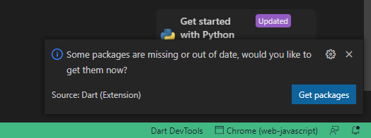

# Setup Flutter Project

Chess AI Game Flutter Project is the main project that you will work on, this project is built on top of Flutter and we use GetX for state management, we try to make it as clean as possible and easy to understand, we will setup this flutter project in this section.

## Step No.1 Open Project in Visual Studio Code

1. Extract the downloaded Chess AI Game project zip file to your desired location
2. Open Visual Studio Code
3. Go to File > Open Folder (or press Ctrl+K Ctrl+O)
4. Navigate to the extracted `chess_ai_game` project folder
5. Click "Select Folder" to open the project

Or

- Open CMD if you use windows
- Go to `/chess_ai_game` directory
- and type `code .`
  
You should now see the project structure in the VS Code explorer panel on the left side.

### Project Structure Overview

The main project folders you'll work with:

- `lib/app` - Contains all the Flutter source code
- `config/` - Contains all the configuration files
- `models/` - Contains all the class models, like game, player, move, puzzle, etc.
- `modules/` - Contains all the pages of the app, like game board, menu, puzzles, settings, etc.
- `services/` - Contains all the services, like game logic, multiplayer, puzzle database, etc.
- `utils/` - Contains all the utils, like helper, constants, board themes, etc.
- `translations/` - Contains all the translations, like en, es, fr, de, etc.

## Step No.2 Install Dependencies

Once the project is open:

## Step No.2 Install Project Dependencies

Once Chess AI Game Flutter project opens in Visual Studio code or in Android Studio, we will install all the dependencies

when you open Chess AI Game Flutter project for the first time in Visual Studio Code, Usually a dialog will appear in the bottom right corner, asking you to directly install all dependencies, just click `Get packages`

but if the dialog doesn't appear, or an error occurs while installing dependencies, you can directly install all dependencies in the following way

- open terminal in Visual Studio Code `` CTRL + ` `` or `Click Terminal -> New Terimal`
- type `flutter pub get`
- once that's done, all dependencies should be installed

You're now ready to start working with the Chess AI Game Flutter project!
