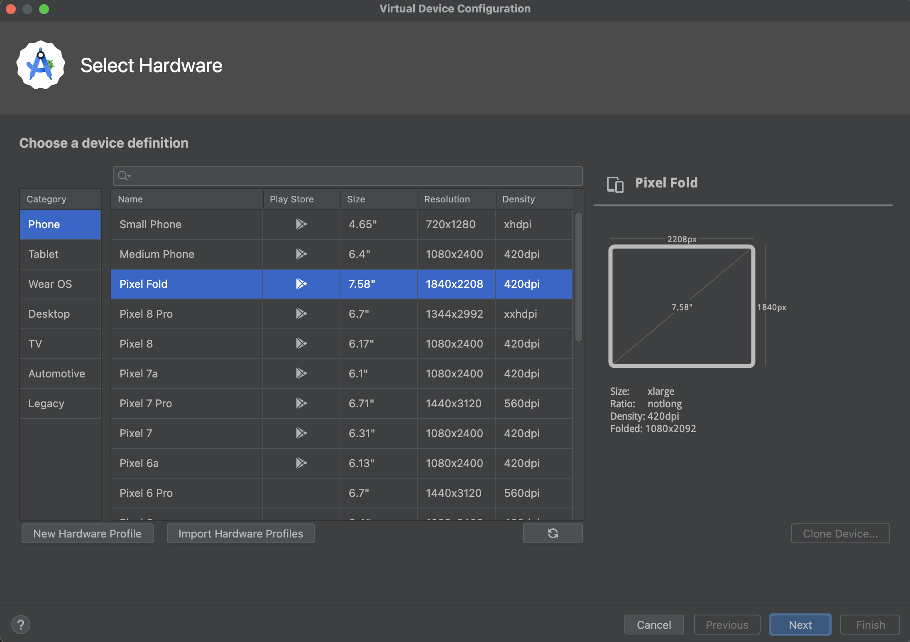

# Run Chess AI Game on Emulator

This guide will help you run the Chess AI Game on an Android emulator for testing and development purposes.

## Prerequisites

Before running the app on an emulator, make sure you have:

1. **Android Studio** installed on your computer
2. **Flutter SDK** properly configured
3. **Chess AI Game project** set up (see Setup Flutter Project guide)
4. All project dependencies installed (`flutter pub get`)

## Step 1: Set up Android Emulator

### Create a New Virtual Device

1. Open **Android Studio**
2. Go to **Tools > AVD Manager** (Android Virtual Device Manager)
3. Click **Create Virtual Device**



4. Choose a device definition (recommended: **Pixel 4** or **Pixel 6**)
5. Click **Next**

### Select System Image

1. Choose an Android version (recommended: **API 30** or higher)
2. If not already downloaded, click **Download** next to your chosen system image
3. Wait for the download to complete
4. Click **Next**

### Configure AVD

1. Give your emulator a name (e.g., "Chess_Game_Emulator")
2. Configure additional settings if needed:
   - **RAM**: 2048 MB or higher
   - **Internal Storage**: 2048 MB or higher
   - **SD Card**: 512 MB (optional)
3. Click **Finish**

## Step 2: Start the Emulator

1. In AVD Manager, find your created emulator
2. Click the **Play** button (▶️) to start it
3. Wait for the emulator to fully boot up (this may take a few minutes)

## Step 3: Run Chess AI Game

### Using VS Code

1. Open the Chess AI Game project in **Visual Studio Code**
2. Make sure the emulator is running and detected:
   - Open Command Palette (`Ctrl+Shift+P`)
   - Type "Flutter: Select Device"
   - Choose your emulator from the list
3. Press **F5** or go to **Run > Start Debugging**
4. Alternatively, use the terminal:
   ```bash
   flutter run
   ```

### Using Android Studio

1. Open the Chess AI Game project in **Android Studio**
2. Make sure your emulator is selected in the device dropdown
3. Click the **Run** button (▶️) or press **Shift+F10**

### Using Command Line

1. Open terminal/command prompt
2. Navigate to your Chess AI Game project directory:
   ```bash
   cd path/to/chess_ai_game
   ```
3. Check if emulator is detected:
   ```bash
   flutter devices
   ```
4. Run the app:
   ```bash
   flutter run
   ```

## Step 4: Verify Installation

Once the app launches on the emulator, you should see:

1. **Chess AI Game splash screen**
2. **Main menu** with options:
   - Play vs AI
   - Multiplayer
   - Puzzles
   - Practice
   - Settings
3. **Functional chess board** when starting a game
4. **AI opponent** responding to your moves

## Troubleshooting

### Common Issues

#### Emulator not detected
```bash
# Check if emulator is running
flutter devices

# If not listed, restart the emulator
```

#### Build errors
```bash
# Clean and rebuild
flutter clean
flutter pub get
flutter run
```

#### Performance issues
- Increase emulator RAM to 4GB or higher
- Enable hardware acceleration in AVD settings
- Close unnecessary applications on your computer

#### App crashes on startup
- Check if all Firebase configuration files are properly placed
- Verify all dependencies are installed
- Check console logs for specific error messages

### Performance Tips

1. **Enable Hardware Acceleration**:
   - In AVD Manager, edit your emulator
   - Set Graphics to "Hardware - GLES 2.0"

2. **Allocate More Resources**:
   - Increase RAM to 4GB for better performance
   - Set Multi-Core CPU to 4 cores if your computer supports it

3. **Use Quick Boot**:
   - In AVD settings, enable "Quick Boot"
   - This saves emulator state for faster startup

## Next Steps

Once you have successfully run the Chess AI Game on the emulator:

1. Test all game features (AI gameplay, multiplayer, puzzles)
2. Try different board themes and settings
3. Test multi-language support
4. Verify music and sound effects
5. Test game statistics and progress tracking

The emulator environment allows you to test the complete Chess AI Game experience before deploying to real devices.