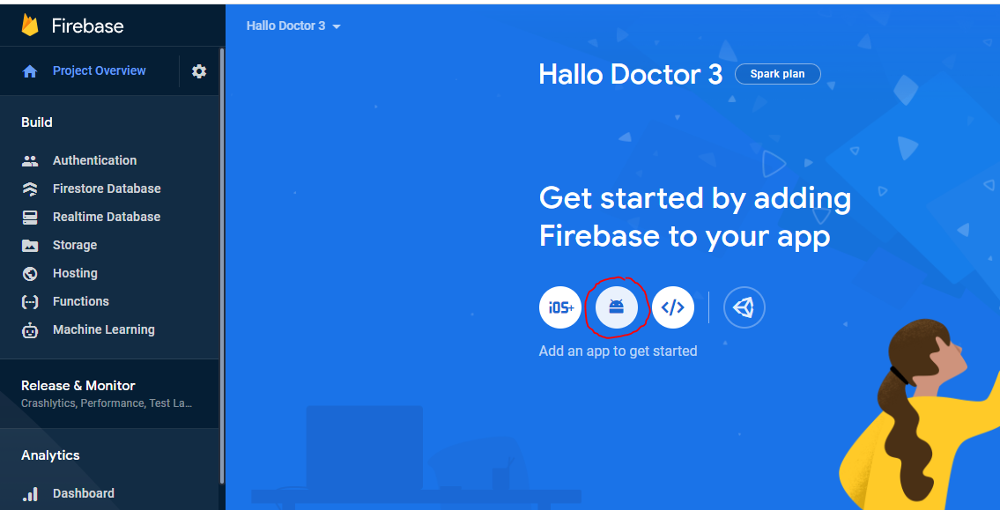
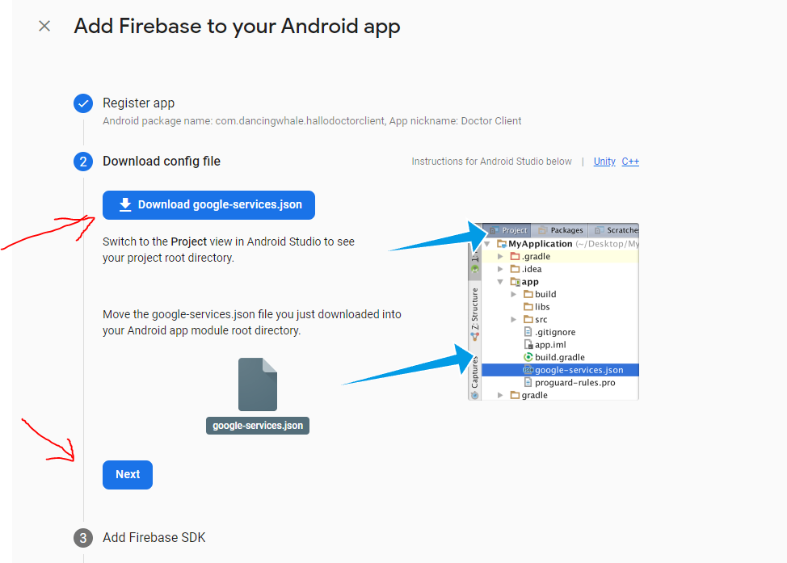
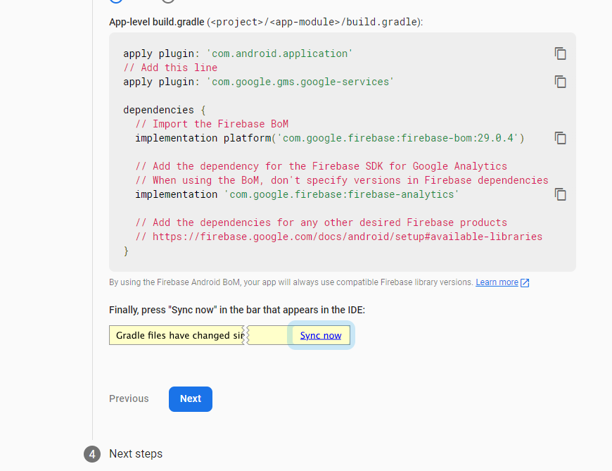

# Create Android App in Firebase Project

After creating a firebase project, in this project we can create several apps with different configuration, here we will create Chess AI Game Android App.

## Create Chess AI Game Android App

- Click android icon



- After that we are required to fill in three information about our app, `Package Name`, `App Name`, and `SH1 Key`

  

- first we need the package name of our app, to get the package name of our app

### Get Package name

- in your Project Flutter `chess_ai_game`, which was already open using visual studio code, or Android Studio

:::info
Package names in Android serve as unique identifiers for your app. They follow these conventions:

- Must have at least two segments (one dot)
- Written in all lowercase
- Each segment should start with a letter
- Only letters, numbers, and underscores are allowed
- Common format: `com.companyname.appname`

Examples:

- ✅ `com.google.android`
- ✅ `io.flutter.myapp`
- ✅ `com.company.app_name`
- ❌ `com.MyApp` (uppercase not allowed)
- ❌ `com.my-app` (hyphens not allowed)
- ❌ `com` (needs at least two segments)

:::

- For your app, choose a package name that follows this structure:
  - First segment: Domain extension (`com`, `io`, `org`)
  - Second segment: Your company/organization name
  - Third segment: Your app name
  
  For example: `com.chessai.game`

:::warning
Once you publish your app on the Google Play Store, the package name cannot be changed. Choose carefully!
:::

- we will change the default package name of this app to your package name, this will be very easy and fast because this project already uses `change_app_package_name` flutter package [https://pub.dev/packages/change_app_package_name](https://pub.dev/packages/change_app_package_name)

- run the command below, but first change `com.mycompany.myappname`, to your package name

```
flutter pub run change_app_package_name:main com.mycompany.myappname
```

- if successful it will look like this


- so after that, the package name in your `chess_ai_game` app has all changed,
  and you can copy the package name to firebase
- and add your App nickname


- for debug signing, we can fill it later, just click register app

- after that you have to download the `google-service.json` file



- and copy the file into your `chess_ai_game` flutter project in the directory `android/app/`


:::info
if there is already a `google-services.json` file in that folder, replace it with the new file you just downloaded. Make sure the filename is exactly `google-services.json` without any typos.
:::

- after that click next in firebase,



- and click Continue to console


- Congratulations! Your app is now registered.
- However, we still need to enable some Firebase features for our app, such as authentication for player login functionality. Let's proceed to the next section.
