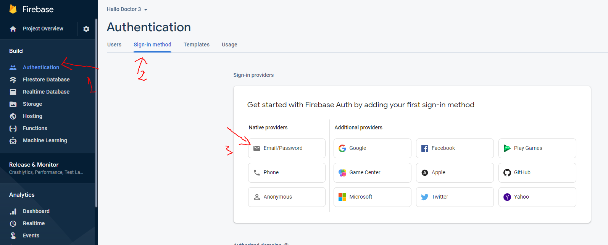
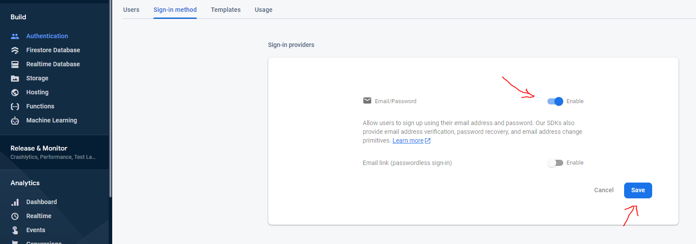
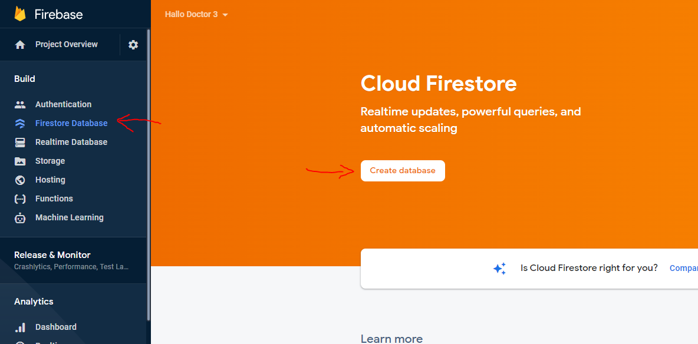
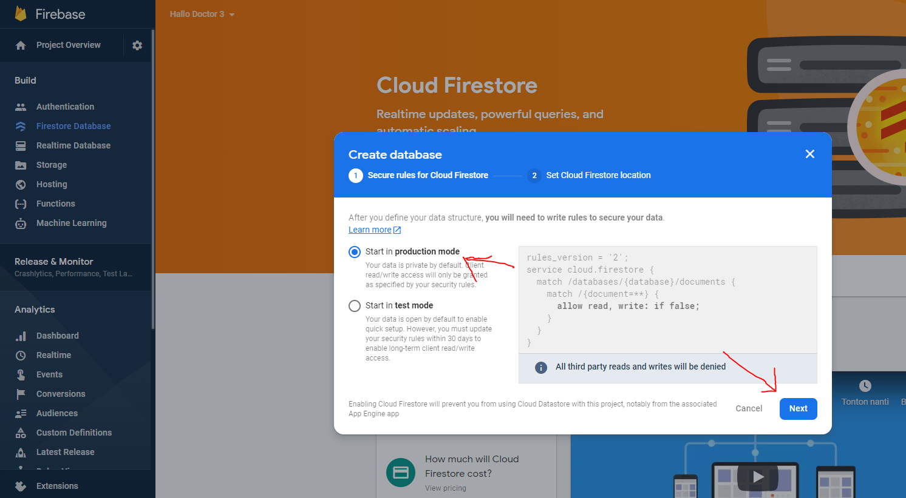
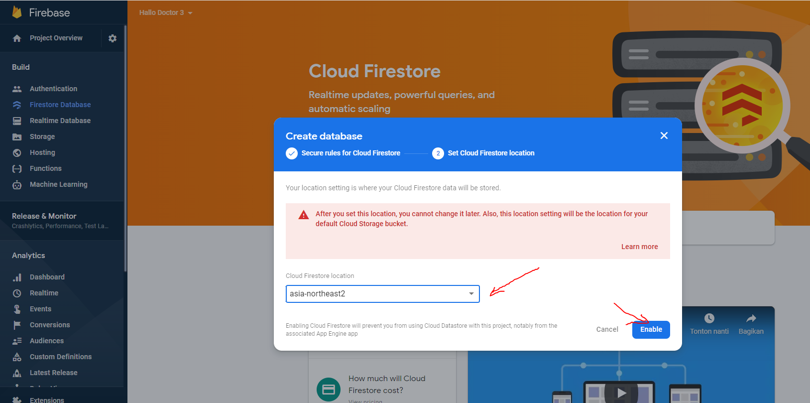
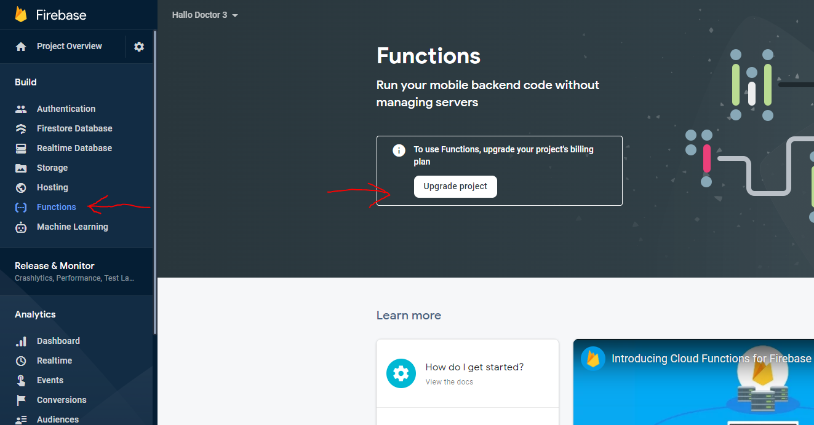
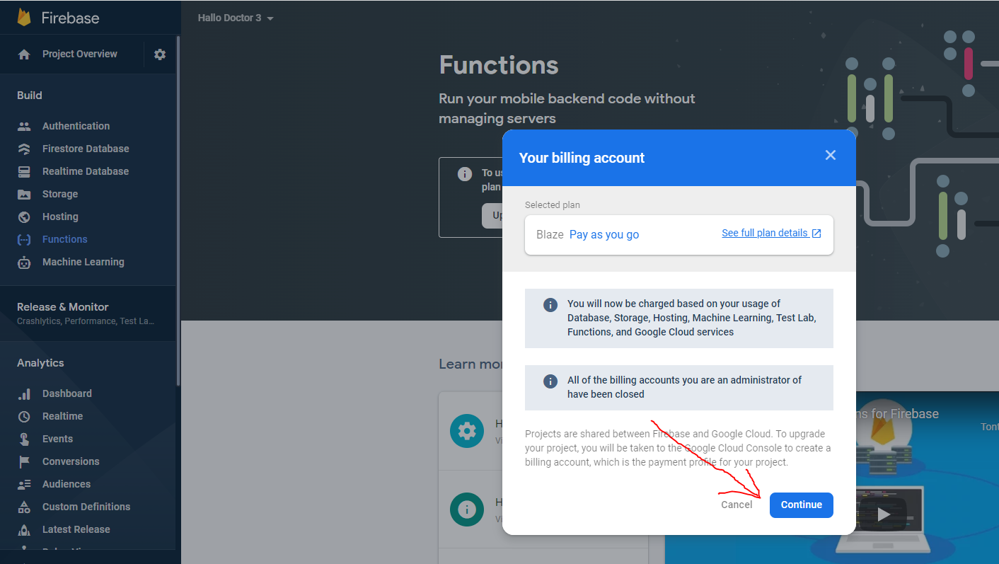
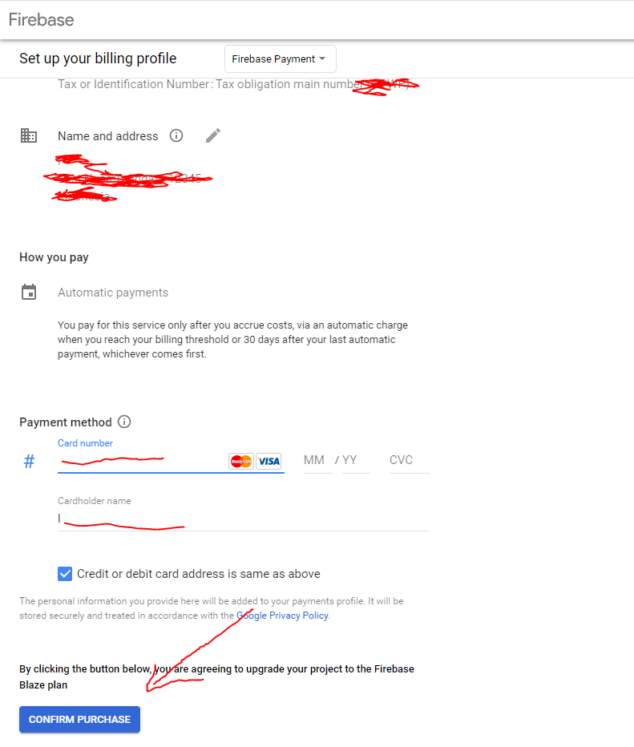
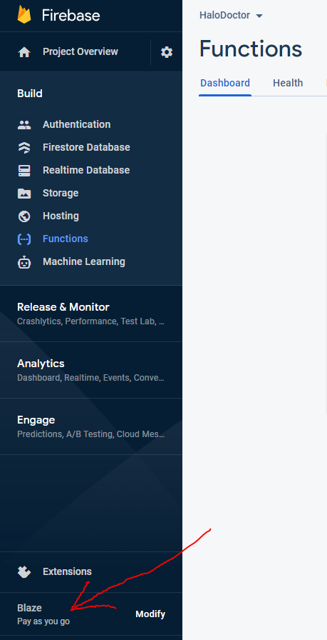

# Enable Firebase Feature

after we add our app in firebase and put the `google-service.json` file into our project, we need to enable some firebase features that our chess game app uses, first is the authentication feature, so that players can register a new account and also login

# 1. Enable Firebase Authentication

- in Firebase Dashboard, click `Authentication` -> `Sign in Method` -> `Email/Password`

- and then enable email, and click `save`

:::info
For now we only enable email/password authentication, you can also enable other authentication methods such as google sign-in, etc.
:::

# 2. Enable Firebase Firestore

we also need to enable Firebase Firestore, so we can save our chess game data in firebase

- click `Firestore Database` -> `Create Database`

- and chose `Start in Production Mode` -> and then click `Next`

- and then chose datacenter near you, and click `Enable`

# 3. Enable Firebase Functions

we also need to enable Firebase Firestore, but to activate the firebase function, we are required to upgrade our project to the Blaze Plan

- Click `Function` and click `Upgrade Project`

- Click `Continue`

- and here you are required to enter payment information, but don't worry you will not be charged a fee, as long as your resource usage is still within the limits set by firebase here [https://firebase.google.com/pricing](https://firebase.google.com/pricing)

- After your blaze plan is active, your firebase function should also be active

# 4. Enable Firebase Realtime Database

We also need to enable Firebase Realtime Database, this feature is needed for real-time game synchronization and player presence detection. If a player is suddenly disconnected from the game, the game state will be properly handled

- click `Realtime Database` -> `Create Database`

- Choose your database location, and click `Next`
  

- For this security rules, we will use test mode, so that we can test the database without any restrictions,
  later in production, you need to change this security rules to secure your databases, click `Enable`

- Okay, for now that's the only feature that must be activated in this Firebase panel, the rest will be activated when we deploy the Firebase Cloud Functions
