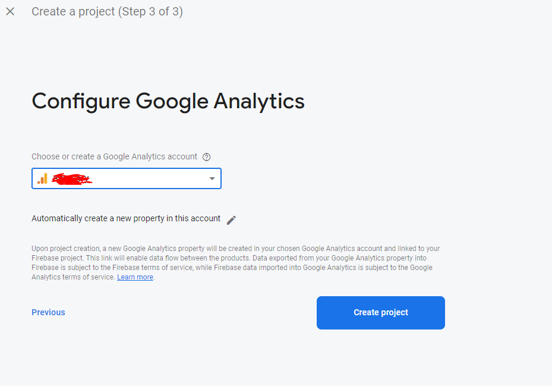

# What is Firebase

Firebase is a Backend-as-a-Service (BaaS). It provides various tools and services that our Chess AI Game Project needs, such as Authentication, Realtime Database, Cloud Storage, Cloud Functions, Cloud Messaging, and many more. We will use Firebase as our main backend service. You can get started for free, We will guide you through setting up Firebase and creating an Android App within this project.

## Setup Firebase

- Register a Free account at [https://console.firebase.google.com/](https://console.firebase.google.com/)
- Create a new Firebase project

- After that enter your `app name` it can be up to you, here I enter the name "Chess AI Game"

- and then click Continue

- Then you will be asked to choose your Google Analytics account
- choose your account and click Create Account

- Congratulations! You have successfully created your Firebase project. Next, we will proceed to create Android App within this project.
