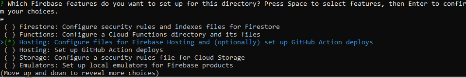

# Deploy Admin Dashboard

After you can run the Admin Dashboard locally, in this step, we will Deploy that Admin Dashboard to Firebase Hosting

## Step 1: Build the Admin Dashboard

    Before we can deploy the Admin Dashboard to Firebase Hosting, we need to build the Admin Dashboard first, run this command at the root of the `Admin Dashboard` folder:

    ```
    npm run build
    ```

## Step 2: Initialize Firebase Hosting

After the build is done, initialize Firebase hosting in your Admin Dashboard folder using this command:

1. After the build is done, initialize Firebase hosting in your Admin Dashboard folder using this command:

   ```
   firebase init
   ```

   

   Press Enter.

    You'll be asked to choose which Firebase features to activate in this folder. Choose `Hosting: Configure File for Hosting`.

   

   If you get asked to choose your Firebase project, choose the project that you set up previously. choose `Use an existing project`

   

   You'll be asked to enter the name of your public directory folder. Enter `dist` because the build folder is the default build folder of this React Vite project.

   

   Answer N or press Enter to the rest of the questions.

   

   

   

   

## Step 3: Publish the Admin Dashboard to Firebase Hosting

After initializing Firebase, publish it to Firebase hosting using the following command:

   ```
   firebase deploy
   ```


- if it success you will get the url of your Admin Dashboard, you can open it in your browser and log in using your email and password that you previously set up in the [Create Admin Credentials](../setup-firebase/create_admin_credential) tab


- After you setup the admin dashboard, in the settings page, -> `Streaming` you need to setup `Streaming Server`, `RTMP Server`, `Viewer Count Websocket URL`, we will setup our own Streaming Server, RTMP Server, and Viewer Count Websocket URL in the next step.


